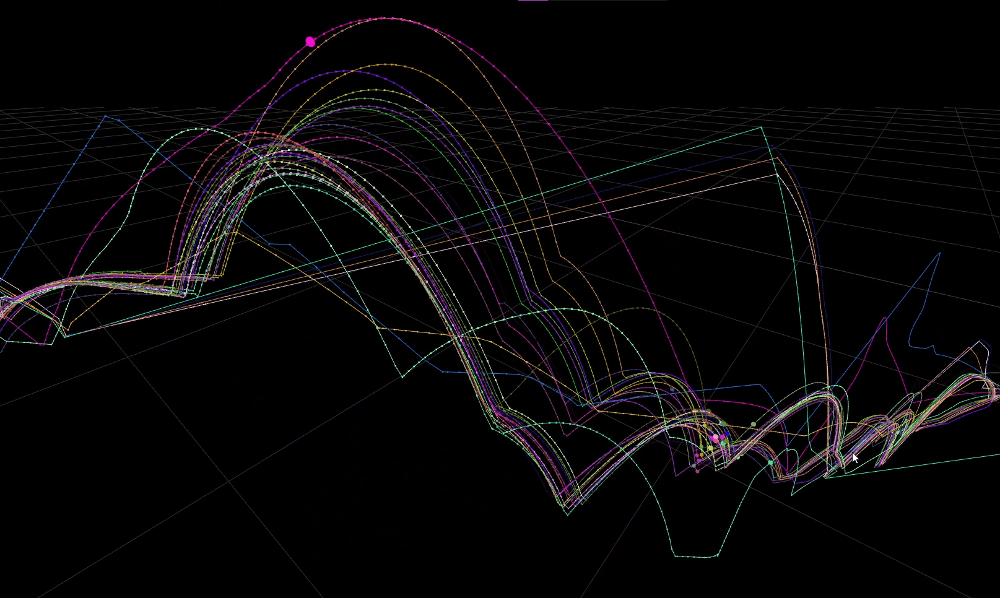

# Neon White Ghost Visualizer

A tool for **Neon White players** to upload and visualize ghost files.
You can upload your own ghosts and compare them with others in **3D real-time simulations**.

This tool helps you better understand your timeloss in runs by seeing differences in lines and speed across a level.

---

## Features
- Upload your own ghosts or ghost files from others
- View runs in a 3D environment with real-time playback
- Compare multiple runs side by side

---

## Usage
1. Open the site, [hosted via GitHub Pages here](https://derelictjade.github.io/Ghost-Visualizer/).
2. Upload one or more Neon White ghost files (`.phant`).
3. Use the controls to move the camera, play/pause runs, and compare them in real time.

---

## Controls
- **WASD** keys move the camera
- **Left Click + Drag** rotates the camera
- **Right Click + Drag** pans the camera
- **Scrolling** does, something hard to explain 🔥

---

## Accuracy Notes
Firstly, ghosts from before the pre-ensure timer era can have a slightly delayed start.
The way the game records ghosts also isn't the most accurate and can be rough in sections, simulations are not perfect representations of runs but they're accurate enough to see run differences and approximate timesave/timeloss in sections.

---

## Feedback
If you have ideas, feature requests, bug reports, or general feedback, do tell me!
